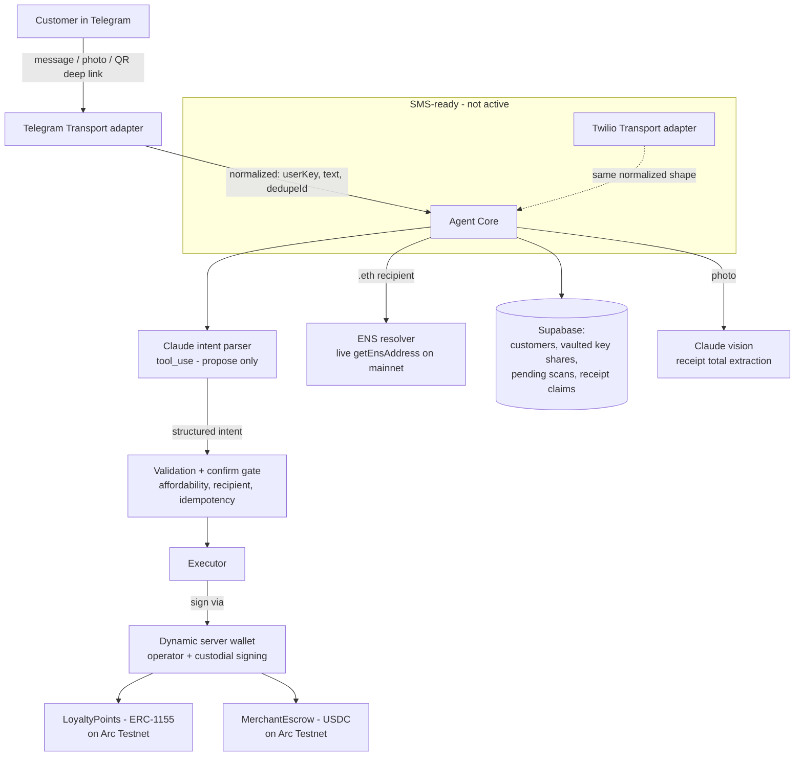

# Giving Genie — AI loyalty rewards over chat, settled in USDC on Arc

> Working title — rename to taste. Tagline: *Snap a receipt, earn points, gift them to a friend. No app, no wallet, no seed phrase.*

An AI agent (Telegram today, SMS-ready) that runs an on-chain cashback program for small businesses. Customers earn USDC-backed loyalty points by photographing a receipt or scanning a QR code, then check, redeem, or gift those points — all in a chat thread, with a custodial smart wallet provisioned silently behind the scenes. Every gift carries the business's name, turning each redemption into organic acquisition.

---

## The problem

Enterprise loyalty platforms are out of reach for small businesses, and traditional points are siloed, illiquid, and expire — so customers don't value them. Crypto-based loyalty usually fails the other way: it demands wallets, seed phrases, and onboarding friction that kills adoption.

LoyalChain removes the friction entirely. The customer never sees a wallet, a key, or a gas prompt. They message a bot. Points are real, USDC-backed, redeemable for cash, and giftable — and the merchant funds a single USDC pool that backs the whole program.

---

## What it does

- **Onboard with zero crypto knowledge** — a QR scan deep-links into the bot and a custodial wallet is provisioned automatically, keyed to the user's chat identity.
- **Earn two ways** — scan a signed QR receipt, or photograph any receipt and let the AI read the total (1 point per $1).
- **Check balance** — natural-language ("how many points do I have?").
- **Redeem** — points → USDC, paid from the merchant's escrow pool, settled on Arc.
- **Gift** — send points to another user by @username *or* by ENS name (`alice.eth`), with live on-chain resolution. The confirmation names the business.
- **Safety throughout** — the AI proposes intents; the backend independently validates affordability, recipients, and amounts before anything moves, behind a confirm-then-execute gate.

---

## Architecture



The transport is an **adapter behind a seam**: the core depends only on a normalized `{ userKey, text, dedupeId }` shape, never on Telegram or Twilio types. Adding SMS later is one new adapter file, no core changes.

---

## Sponsor integrations

> Submitting for the bounties below. Each integration is core to the product, not a bolt-on.

### Arc — Best Smart Contracts with Advanced Stablecoin Logic

The heart of the app is `MerchantEscrow`, a **conditional-release USDC escrow**: a merchant pre-funds a USDC pool, and `redeem()` atomically burns a customer's loyalty points and releases the corresponding USDC — programmable, multi-step settlement in a single transaction. Deployed and running on **Arc Testnet** (chainId `5042002`), where USDC is the native settlement asset. All point crediting and redemption settle on Arc.

- `LoyaltyPoints` (ERC-1155, token id = merchant id) — multi-merchant points in one contract.
- `MerchantEscrow` — funded USDC pool, integer-safe redemption math, atomic burn-and-pay.
- Deployed addresses: LoyaltyPoints `<ADDR>`, MerchantEscrow `<ADDR>` — view on https://testnet.arcscan.app

### Dynamic — Best Agentic Build

Wallets are powered end-to-end by **Dynamic server wallets** (`@dynamic-labs-wallet/node-evm`, MPC). One operator/relayer wallet signs and executes every on-chain action (mint, redeem, gift), and per-customer custodial wallets are provisioned programmatically — no seed phrases, no per-action popups. The agent decides what to do from a natural-language message, then executes it on Arc through Dynamic. Key shares are stored segregated and vaulted (see Security).

### ENS — Integrate ENS pool

Gifting supports **live ENS resolution**: a `.eth` recipient is resolved with a real `getEnsAddress` call against Ethereum mainnet (a dedicated mainnet client, since ENS resolution always starts on L1), and the resolved address is used as the gift recipient. No hard-coded name→address values — resolution is live on every gift, and the confirmation message shows `name → 0x…` so it's visible in the demo.

---

## How it works (flows)

**Onboarding.** A QR receipt deep-links to the bot as `/start <token>`. The backend resolves the token to a server-stored, EIP-712-signed receipt, verifies the signature against the registered merchant, creates-or-looks-up the customer by chat identity, and provisions a custodial Dynamic wallet. The signed-QR path is the fraud-resistant, production-shaped onboarding.

**Earning by photo.** The user sends a photo; Claude vision extracts `{ total, merchant, date }`; points = floor(total). Image-hash and content-hash dedupe plus per-receipt and per-day caps guard against the obvious abuse. (See limitations — this path trades cryptographic proof for convenience.)

**Spending.** Messages from known customers are parsed by Claude into one of four tools (`check_balance`, `redeem_points`, `gift_points`, `help`). The parser only *proposes*; the backend re-derives every money fact from on-chain/DB state, then redeem/gift require an explicit `YES` confirmation before the operator wallet signs. Duplicate messages are deduped so a retried update can't double-spend.

---

## Tech stack

- **Contracts:** Solidity, Hardhat 3 + viem toolbox, OpenZeppelin 5
- **Chain:** Arc Testnet (Circle's EVM L1) — chainId `5042002`, USDC as native gas token
- **Wallets:** Dynamic server wallets (MPC)
- **Agent:** TypeScript, grammY (Telegram), Anthropic API (`claude-sonnet-4-6`) for intent parsing + receipt vision
- **Storage:** Supabase (Postgres) with row-level security
- **Identity / gifting:** ENS via viem `getEnsAddress` (mainnet)
- **Package manager:** pnpm

---

## Repo structure

```
contracts/   Hardhat workspace — LoyaltyPoints.sol, MerchantEscrow.sol, deploy + scripts
server/      agent service: transport adapters, core, intent parser, executor, db
  transport/   Transport interface + TelegramTransport (SMS adapter stub for later)
  core/        onboarding, agent service, pending-action store
  intent/      Claude tool_use parser, prompt, validation
  chain/       Arc client, ABIs, executor (mint/redeem/gift)
  ens/         mainnet client + live .eth resolution
  db/          Supabase repo + migrations
spike/       throwaway verification: Dynamic server wallet on Arc (kept as reference)
```

---

## Running locally

> Prerequisites: Node, pnpm, a Telegram bot token (via BotFather), a Dynamic environment, a Supabase project, and an Arc-funded operator wallet.

```bash
# contracts
cd contracts
pnpm install
pnpm hardhat compile
# deploy to Arc, then register a merchant + fund the escrow USDC pool
pnpm bootstrap

# agent
cd ../server
pnpm install
pnpm dev          # starts the Telegram bot (long-polling)
```

Fund the **operator wallet with testnet USDC from the Circle faucet** before running — on Arc, USDC pays for gas, and the escrow needs a funded pool to pay out from.

### Environment variables

```
# AI
ANTHROPIC_API_KEY=

# Telegram
TELEGRAM_BOT_TOKEN=

# Dynamic
DYNAMIC_ENVIRONMENT_ID=
DYNAMIC_AUTH_TOKEN=

# Arc
ARC_TESTNET_RPC_URL=https://rpc.testnet.arc.network
ARC_CHAIN_ID=5042002
USDC_ADDRESS=0x3600000000000000000000000000000000000000
LOYALTY_POINTS_ADDRESS=
MERCHANT_ESCROW_ADDRESS=
RELAYER_PRIVATE_KEY=         # or Dynamic operator wallet refs
MERCHANT_TEST_PRIVATE_KEY=   # signs receipts; address must match merchants registry

# ENS (mainnet, read-only resolution)
MAINNET_RPC_URL=

# Supabase
SUPABASE_URL=
SUPABASE_SERVICE_KEY=
```

---

## Security & trust model

- **Key custody.** Customer wallets are MPC server wallets. The secret key-share material lives only in a dedicated, default-deny Supabase table (never co-located with addresses, never logged via a redacting logger). Wallet metadata is stored separately on the customer row.
- **Receipt authenticity (QR path).** Receipts are EIP-712 signed by the merchant; the backend verifies the signature against the registered signer and binds the nonce to the scan token to prevent replay. A forged or reused receipt is rejected before any mint.
- **Money safety.** The AI never executes — it proposes a structured intent, and the backend independently validates affordability, recipient existence, and amounts, behind a confirm-then-execute gate, with idempotency on every inbound message. The intent parser was adversarially tested (injection attempts and vague-amount prompts all degrade to help/clarify, never a money action with a fabricated number).

---

## Known limitations (honest, and on the roadmap)

This is a hackathon build. Several deliberate shortcuts were taken to ship a working demo; documenting them here rather than hiding them:

1. **Photo receipts have no cryptographic proof and credit immediately** (no confirm gate). The only abuse defenses on that path are image/content-hash dedupe and per-receipt/per-day caps — enough to stop casual abuse, not a determined faker. The signed-QR path is the trust-preserving alternative. *Next: require signed or merchant-verified receipts before crediting.*
2. **Custodial signing.** Because the escrow's `redeem()` burns `msg.sender`, the customer's own wallet must sign — so the backend loads customer key shares at execution time. *Next: refactor the contract to take an explicit `from` and let the operator move tokens as an approved operator, so customer shares are never loaded at runtime.*
3. **USDC decimal display verification pending.** Native Arc USDC is 18-decimal while the ERC-20 interface is 6-decimal; the contract math is consistent, but the user-facing balance display needs a final manual check against on-chain deltas.
4. **SMS transport not live.** A2P 10DLC carrier registration takes days, so Telegram is the active transport. The SMS (Twilio) adapter is stubbed behind the same seam and slots in once a toll-free number is verified.
5. **Transitive dependency advisories.** `pnpm audit` flags advisories (mostly an outdated `axios`) deep inside the Dynamic SDK's MPC dependency tree — no direct dependency is affected and they're not patchable by this project. Flagged to Dynamic; revisit before production.
6. **Pending-action expiry** is code-verified (a stale confirmation safely does nothing) but not yet exercised in a live timed test.

---

## Roadmap

- Merchant dashboard: self-serve signup, fund the USDC pool, set the points-per-dollar rate.
- Multi-merchant aggregation and a points marketplace.
- Move minting off the immediate-credit photo path onto verified receipts.
- Production SMS via verified toll-free messaging.
- ENS subnames per customer as a first-class identity layer.

